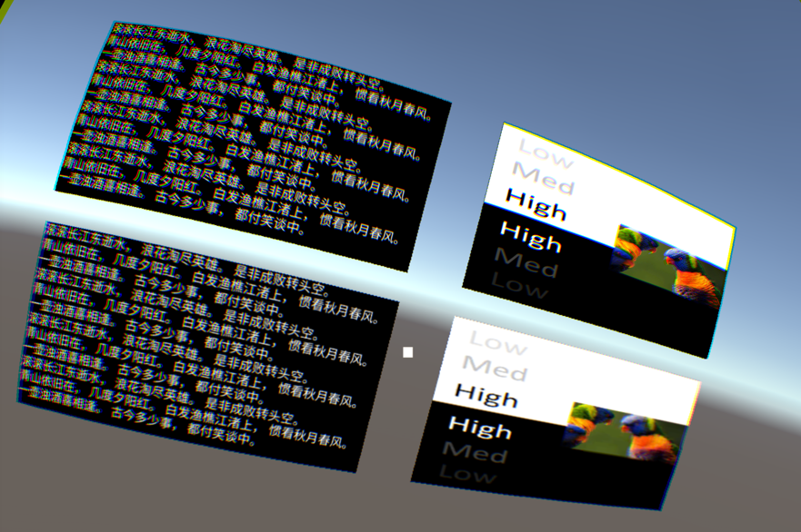
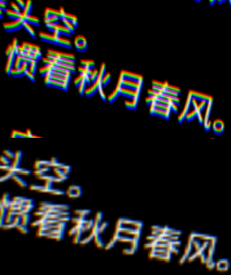
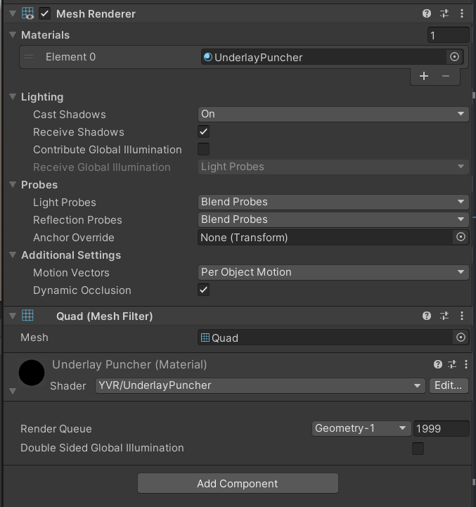

# 合成层

合成层（Compositor Layers）可以用来展示场景中的焦点对象，例如信息、文本、视频以及纹理，也可以用来展示简单的场景环境和背景。通常来说，渲染 VR 内容时，左右眼摄像机首先将场景内容渲染到 Eye Buffer 上；绘制完成后，异步时间扭曲线程（Asynchronous Timewarp，ATW）对 Eye Buffer 进行畸变、采样、合成等处理；处理完毕后，场景内容最终被渲染到屏幕上。若通过合成层技术进行场景渲染，则无需将场景内容绘制到 Eye Buffer 上，而是直接透传给 ATW 线程进行畸变、采样、合成等处理。因此，减少了一次额外的纹理采样，简化了整个渲染流程，同时可提升渲染质量。

## 注意事项

- 目前，单个场景支持的合成层数量最多为 15，超过 15 层将不会显示。 

- 考虑到对性能的影响，建议单个场景的合成层数量控制在 4 层左右。 

- 应该遵循近处物体遮挡远处物体的规则来使用合成层，否则可能会出现轻微晃动。

## 合成层类型

| **类型** | **说明** | 
| -------- | ------- |
| Overlay | Overlay 类型的合成层将纹理呈现在 Eye Buffer 前面，默认为该选项。使用该类型的合成层时，需注意以下事项： <ul><li>勾选 Texture Rects 选框后，若选择自定义 Source Rects 和 Destination Rects（即选择 Custom 选项），则需确保 X、Y、W、H 的值位于指定区间内：X：[0,1)、Y：[0,1)、W：(0,1]、H：(0,1]</li> <li>使用 Overlay 类型的合成层，并且将 Shape 设置为 Equirect（球体纹理）时，需注意以下事项：<ul><li>Radius 参数用于指定圆柱的半径，当设置为 0 或者正无限大（1.0f/0.0f）时，表示无限大的半径。球面半径无限大时，其展示效果如同空场景中的天空盒。</li> <li>Destination Rects 下的 X 参数无用；W 参数映射到中心角，关于中心点坐标 (0, 0) 对称。</li></ul></li></ul> | 
| Underlay | Underlay 类型的合成层将纹理呈现在 Eye Buffer 后面。由于 Underlay 层依赖于渲染目标上的 alpha 通道。场景中的所有对象绘制到 Eye Buffer 后，你需要在 Eye Buffer 上构建一个 “洞”，使 Underlay 纹理透过这个 “洞” 显示出来。 |

## 合成层形状 

| **形状** | **说明** |
| ---------------- | -------- |
| Quad | 具有四个顶点的四边形平面纹理，通常用来显示场景中的文本或信息。 |
| Cylinder | 具有柱面弧度的圆柱形纹理，通常用于显示曲面 UI 界面。若使用 Cylinder，则：<ul><li>Transform 中心将作为 Cylinder 的中心，Transform 的尺寸将作为 Cylinder 的尺寸，且 Cylinder 中 Transform 的尺寸均为全局尺寸（Global Scale）。其中，Z 作为 Cylinder 的半径，Y 作为 Cylinder 的高，X/Z 作为 Cylinder 的弧长。</li> <li>必须将摄像机放置在圆柱内切球内。如果摄像机接近内切球表面，合成层将无法显示。</li></ul> | 
| Equirect | 球体纹理，通常用于显示 360/180 全景纹理。 | 

## 合成层深度

合成层深度（Depth）用于定义合成层在场景中的顺序。数值越小，越靠近 Eye Buffer。假设一个场景中添加了三层 Overlay 和三层 Underlay，深度值设定可以为 `[Camera](Overlay)2/1/0[EyeBuffer]0/1/2(Underlay)`。

## 纹理类型

| **类型** | **说明** | 
| -------- | ------- |
| 外部纹理 | 相应的合成层将从外部 Android Surface 直接获取纹理（例如：Android 播放器视频纹理）。该选项将创建一个 Android Surface 并将 Android Surface Texture 直接渲染到 VR 合成层上。若想提升 VR 视频的清晰度，建议使用 External Surface。 | 
| 动态纹理 | 若要将动态内容渲染至该合成层，即为合成层每帧更新纹理，则需要使用动态纹理。例如：若想使用普通摄像机生成的 RenderTexture 图片，则需使用动态纹理。 | 
| 静态纹理 | 若需要渲染静态内容，例如：在画廊中显示一幅画，则需使用静态纹理。 | 

## 纹理

Texture 参数用于指定左右眼透传的纹理。

> [!Note]
> 左右眼必须指定同一张纹理且纹理宽高需保持一致。若想实现 3D 效果，可根据实际情况，为左右眼选择不同的纹理。

## 半径

将 Shape (合成层形状) 设置为 Equirect（球体纹理）时，需要配置 Radius 参数，指定圆柱的半径。

## 纹理矩形

勾选 Texture Rects 选框后，可配置 Source Rects 和 Destination Rects 相关参数。

## 源矩形

| **选项** | **说明** | 
| -------- | ------- |
| Mono Scopic | 为左右眼摄像机选择不同的纹理，分别显示。 | 
| Stereo Scopic | 纹理左右中分，左眼摄像机显示左半部分，右眼摄像机显示右半部分。   **提示**：建议左右眼指定同一张纹理且纹理宽高需保持一致，否则可能会因为左右眼纹理差别过大而导致异样感。 | 
| Custom | 自定义渲染到物体表面的纹理区域，其中：<ul><li>X 和 Y 用于设置纹理上的起始点</li> <li>W 用于设置纹理区域的宽度</li> <li>H 用于设置纹理区域的高度</li>   如果将 X 和 Y 都设置为 0.5，然后将 W 和 H 都设置为 0.5，那么起始点为纹理的中心，纹理右上角 1/4 的区域将渲染至物体表面。 |

## 目标矩形

| **选项** | **说明** |
| ------- | -------- | 
| Default | 保持目标区域的原始尺寸。 | 
| Custom | 自定义合成层所覆盖的目标区域，其中：<ul><li>X 和 Y 用于设置目标区域的起始点</li> <li>W 用于设置目标区域的宽度</li> <li>H 用于设置目标区域的高度</li>  如果在 Source Rects 参数处，你将 X 和 Y 都设置为 0.5，并且将 W 和 H 都设置为 0.5，在此处，你将 X 和 Y 都设置成 0.5，并且将 W 和 H 都设置成 1，那么物体表面右上方 1/4 区域将被纹理右上方 1/4 区域所覆盖。 | 

## 图层混合

Layer Blend 用于设置 Source 层和 Destination 层的颜色值和透明度值。
 

图层混合可将源图层颜色和目标图层颜色进行混合，常用来绘制透明或半透明的物体。合成层默认从后往前进行混合，若当前场景有合成层 1、2、3、4，则图层混合顺序为：

1. 合成层 4 和 3 优先被混合，作为 Destination 层 1。此时，合成层 2 将作为 Source 层。
2. Destination 层 1 与合成层 2 进行混合，作为 Destination 层 2。此时，合成层 1 将作为 Source 层。
3. Destination 层 2 与合成层 1 进行混合。

| **参数** | **说明** | 
| -------- | ------- | 
| Src Color | 设置的颜色值。 | 
| Dst Color | 设置背景图层的颜色值。 |
| Src Alpha | 设置合成层的透明度值。 | 
| Dst Alpha | 设置背景图层的透明度值。 | 

## 示例

CompositeLayer 场景是用来说明合成层效果的。合成层的设计是为了提高平面 UI 的清晰度。在传统的渲染管道中，UI 纹理必须首先被渲染到 Unity 管理的颜色缓冲区，然后 Unity 管理的颜色缓冲区将被渲染到屏幕缓冲区。而使用合成层时，目标 UI 纹理可以直接由本地渲染。因此，可以减少由采样引起的失真。

在 YVR 设备上运行 CompositeLayer 场景时的屏幕截图如下：
    

> [!CAUTION]
> 由于合成层是由 YVR 设备的原生系统渲染的，所以内容不能在 Unity 编辑器中显示。

下面的部分是由 Unity Eye Buffer 渲染的界面，上面的部分是用合成层渲染的。左边的部分是动态纹理，右边的部分是静态纹理。

使用合成层（上部）和 Unity Eye Buffer（下部）渲染的详细区别如下：
    

> [!CAUTION]
> 在细节图像中可以看到一些色散，这是为抵消镜头造成的色散而产生的。因此，在使用设备时，不会看到所有的色散.

### Underlay vs Overlay

由于原生系统需要对多个图层进行合成，因此需要知道所有图层的顺序。这个顺序是由合成层的深度决定的，Unity Eye Buffer 的深度被设置为 0。而所有深度大于 0 的层被称为 Overlay，而深度小于 0 的层被称为 Underlay。

底层将首先被绘制，然后是 Unity Eye Buffer，最后是 Overlay。因此，Unity Eye Buffer 将覆盖 Underlay，而 Overlay 将覆盖 Eye Buffer。

为了让 Underlay 正常显示，而不是被完全覆盖，需要在 Unity Eye Buffer 中开一个孔。着色器 `YVR/UnderlayPuncher` 被设计用来生成这样的孔： 
    

> [!TIP]
> 示例场景中左上角的图层是底层。