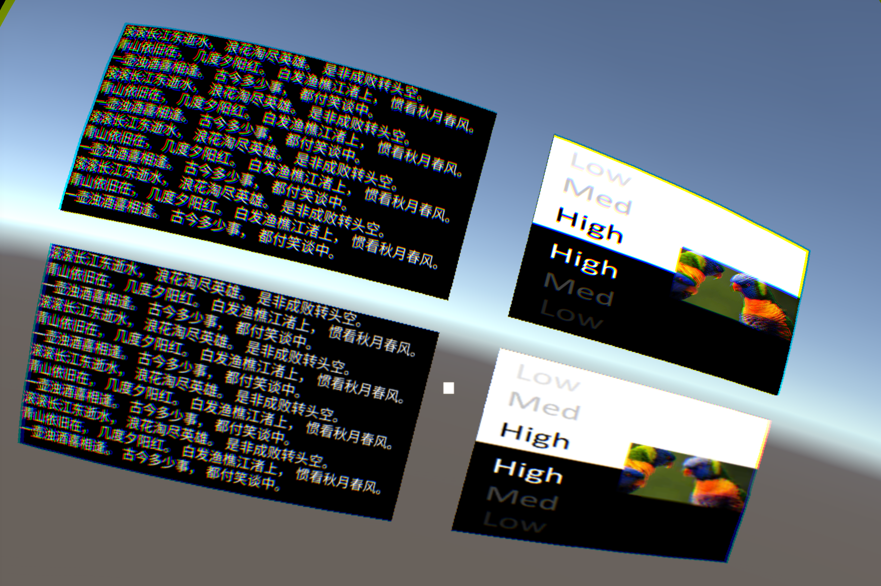

# Compositor Layers

VR compositor layers are used to display information, text, video, or texture that is intended to be the focal part of a scene or to display simple environments and backgrounds. In general, when rendering VR content, the left-eye and right-eye cameras firstly render the content to the eye buffer, and then the ATW thread distorts and samples the eye buffer, after which the content is rendered to the screen. With VR compositor layers, the content is directly passed to the ATW thread for processing such as distortion, sampling, and synthesis. The whole rendering process is therefore simplified.

## Note

- Add no more than 15 compositor layers to a single scene. The exceeded layers will not be displayed.

- To ensure good app performance, it is recommended that you add no more than 4 compositor layers to a single scene.

- Nearby objects should occlude distant ones, otherwise slight shakes can occur to cause visual discomfort.

## Type

| **Type** | **Description** | 
| -------- | --------------- |
| Overlay | The overlay texture is displayed in front of the eye buffer. If you want to use overlay textures, pay attention to the following:  <ul><li>If you would like to customize "Source Rects" and "Destination Rects" related parameters in "Texture Rects", make sure that the values of the "X", "Y", "W", and "H" parameters are within the following required ranges: X: [0,1), Y: [0,1), W: (0,1], H: (0,1]</li> <li>If you set the Shape parameter to Equirect, pay attention to the following: <ul><li>The "Radius" parameter is used to specify the radius of a cylinder. When set to 0 or positive infinity (1.0f/0.0f), it represents an infinitely large radius. When the spherical radius is infinitely large, its visual effect is similar to the skybox in an empty scene.</li> <li>The "X" parameter under "Destination Rects" is useless. The "W" parameter is mapped to the central angle and is symmetric with respect to the center point coordinates (0, 0).</li></ul></li></ul> | 
| Underlay | Underlay textures are displayed behind the eye buffer. Underlay textures rely on the alpha channel of the rendering target. After all the objects have been drawn behind the eye buffer, you need to hollow out an area on the eye buffer to display the Underlay textures behind it.  |

## Shape

| **Shape** | **Description** | 
| --------- | --------------- | 
| Quad | A flat texture with four vertices, which is normally used to display text or information. |
| Cylinder | A texture with cylindrical curves, which is normally used to display curved UI. If you use this shape: <ul><li>The center of the Transform component is the center of the cylinder. The scale of the Transform component is the scale of the cylinder, and the Transform component's scales for the cylinder are all global scales. Specifically, X is the radius of the cylinder, Y is the height of the cylinder, and X/Z is the arc length of the cylinder.</li> <li>When using the Cylinder texture, you must put the camera inside the inscribed sphere of the cylinder. Then you can adjust the distance between the camera and the sphere as overlay textures will not be displayed if the camera is too close to the surface of the inscribed sphere.</li></ul> | 
| Equirect | Sphere texture, which is normally used to display 180/360 panoramic images or videos. | 

## Depth

The Depth parameter determines the order of layer composition. The layer with a smaller depth is composited in front of the layer with a larger depth. For example, the depth of a scene with multiple overlays and underlays can be as follows: `[Camera](Overlay)2/1/0[EyeBuffer]0/1/2(Underlay)`

## Texture Type

| **Type** | **Description** | 
| -------- | --------------- |
| External Surface | A layer's texture will be obtained from an external Android surface, for example, the video texture from an Android player. The texture from the external Android surface will be directly rendered to the VR compositor layer. If you want to improve video quality, external surfaces are recommended. | 
| Dynamic Texture | If you want to render dynamic content to the layer, in other words, to refresh the texture at each frame, you can use dynamic layers. For example, if you want to generate RenderTexture images with normal cameras, you need to use dynamic textures. | 
| Static Textur | You can use static texture to render static content, such as a painting in the gallery. | 

## Texture

The Texture parameter is used to specify the textures to be displayed through the left and right eyes perspectively.

> [!Note]
> You must specify the same texture with the same height and width for the left-eye and right-eye cameras. However, if you want to display 3D effects, you can specify two different textures.

## Radius

When you set the Shape parameter to Equirect, you need to specify the cylinder's radius through the Radius parameter.

## Source Rects

After checking the Texture Rects checkbox, you can continue to configure Source Rects and Destination Rects related parameters.

## Source Rects

| **Option** | **Description** | 
| ---------- | --------------- |
| Mono Scopic | If you want to display two different textures on the left-eye and right-eye cameras respectively, you can select this option. | 
| Stereo Scopic | Vertically split the image from the center. The left part will be displayed on the left-eye camera, and the right part will be displayed on the right-eye camera.   **Note**: It is recommended that you specify the same texture with the same height and width for the left-eye and right-eye cameras. Otherwise, the left-eye and right-eye textures can be too different and lead to discomfort. | 
| Custom | You can set which area of the texture is to be rendered on the object's surface. Specifically: <ul><li>X and Y are for setting an origin on the texture where the rendering area starts</li> <li>W is for setting the width of the texture area</li> <li>H is for setting the height of the texture area</li>   If you set both X and Y to 0.5 and set both W and H to 0.5, the rendering area starts from the center of the texture and 1/4 upper-right area of the texture will be rendered on the object's surface. |

## Destination Rects

| **Option** | **Description** |
| ---------- | --------------- | 
| Default | Keep the original size of the object's surface. | 
| Custom | You can set which area of the object's surface is to be covered by the texture: <ul><li>X and Y are for setting the origin on the object's surface where the to-be-rendered area starts.</li> <li>W is for setting the width of the to-be-rendered area.</li> <li>H is for setting the height of the to-be-rendered area.</li>   If you set both X and Y to 0.5 and set both W and H to 0.5 for the texture in Source Rects, and set both X and Y to 0.5 and set both W and H to 1 here, 1/4 upper-right area of the object's surface will be covered by1/4 upper-right area of the texture. | 

## Layer Blend

Layer Blend is used to set the color and alpha value for the source and destination layers.
 

Layer blending can blend the colors of the source layer and the destination layer, which is often used to render transparent or semi-transparent objects. By default, compositor layers are blended from back to front. If there are layers 1, 2, 3, and 4 in the scene, the layers will be blended in the following order:

1. Layers 4 and 3 are blended to generate destination layer 1. Layer 2 becomes the source layer.
2. Destination layer 1 is blended with layer 2 to generate destination layer 2. Layer 1 becomes the source layer.
3. Destination layer 2 is blended with layer 1.

| **Parameter** | **Description** | 
| ------------- | --------------- | 
| Src Color | For setting the color value of the source layer. | 
| Dst Color | For setting the color value of the destination layer. |
| Src Alpha | For setting the alpha value of the source layer. | 
| Dst Alpha | For setting the alpha value of the destination layer. | 

## Example

CompositeLayer scene is used to illustrate composite layer effect. Composite layer is designed to improve the clarity of flat UI. In traditional rendering pipeline, UI texture has to be firstly rendered into Unity managed color buffer, then the Unity managed color buffer will be rendered into screen buffer. While using composite layer, the target UI texture can be directly rendered by native. Therefore, the distortion caused by sampling can be reduced.

The screenshot while CompositeLayer scene running on YVR device is as follows:
    

> [!Caution]
> As compositor layer is rendered by YVR device native system, the content cannot be displayed in Unity Editor.

The lower part is the UI rendered by Unity eye buffer, and the upper part is rendered using composite layer. And the left part is dynamic texture while right part is static texture.

The detail difference between rendering using composite (upper) and Unity eye buffer (lower) is shown as following:
    

> [!Caution]
> Some color dispersion can be seen in the detailed image, which is generated to cancel out the dispersion caused by lens. So all the color dispersion will not be seen while using devices.

## Underlay vs Overlay

As native system is required to composite several layers, it needs to know the order of all layers. The order is determined by the depth of the composite layer, and the depth of Unity eye buffer is set to zero. And all layers with depth greater than 0 are called overlay while layers with depth less than 0 are called underlays.

Underlays will be drawn firstly, then the Unity eye buffer, and finally the overlays. Thus, Unity eye buffer will cover the underlays, and the overlays will cover the eye buffer.

In order to make underlay to be displayed normally instead of being completely covered, a hole needs to be made in Unity eye buffer. The shader `YVR/UnderlayPuncher` is designed to generate such hole: 
    

> [!Tip]
> The upper-left layer in demo scene is Underlay.